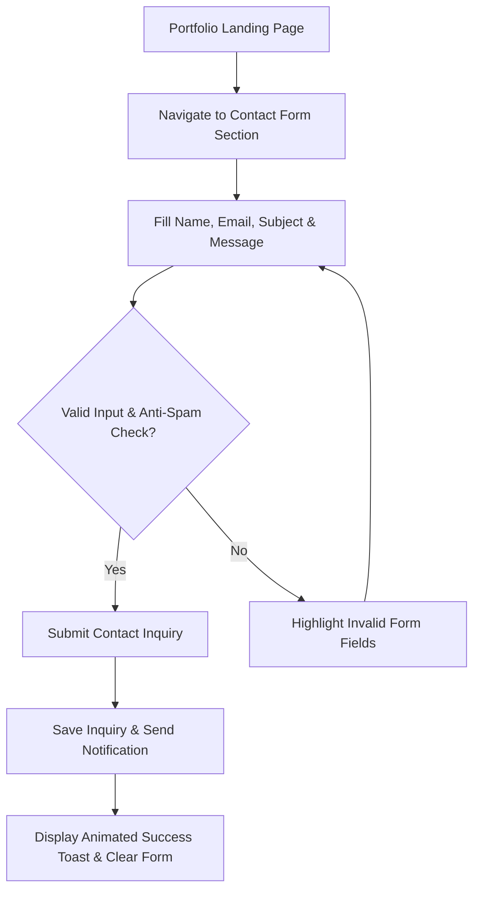
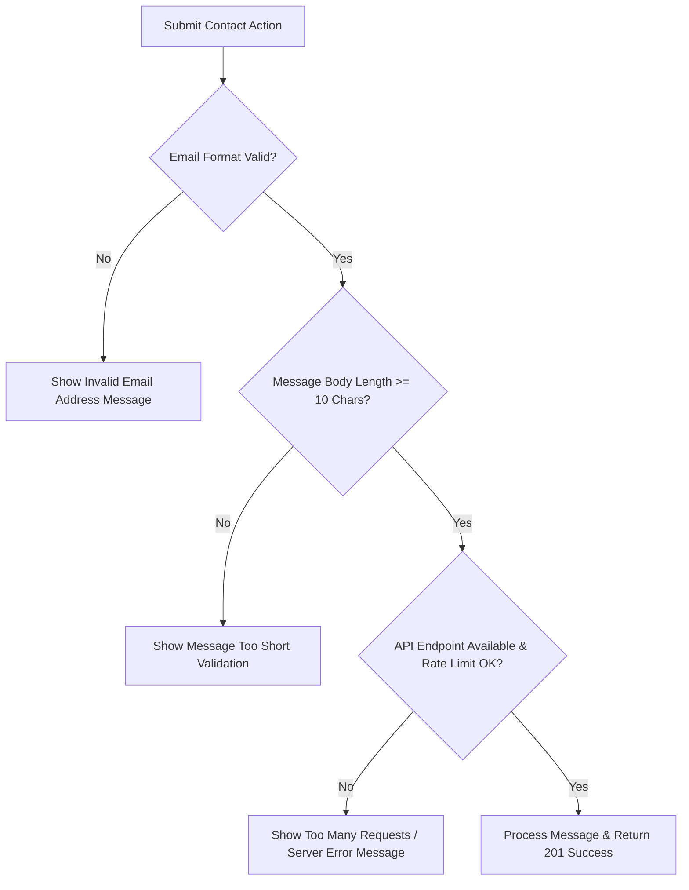
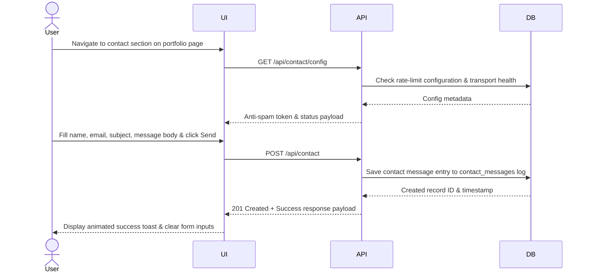
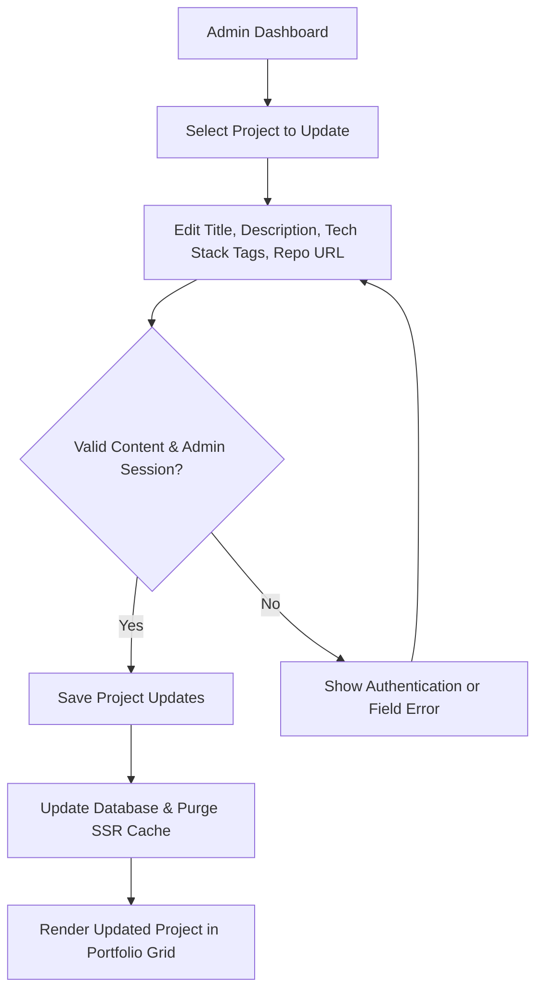
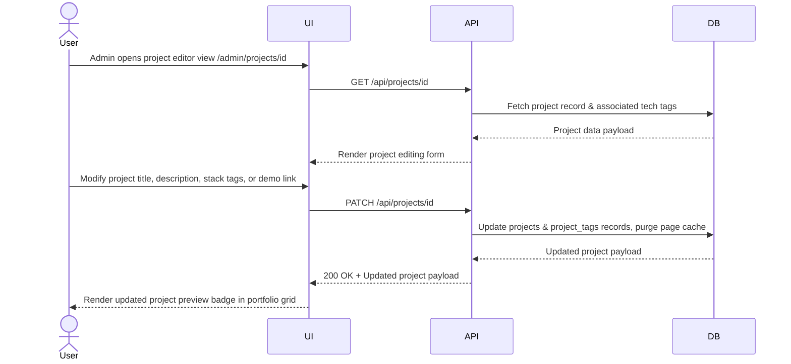
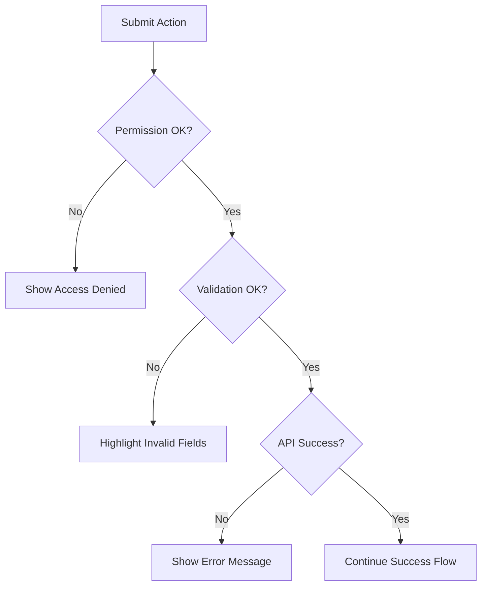
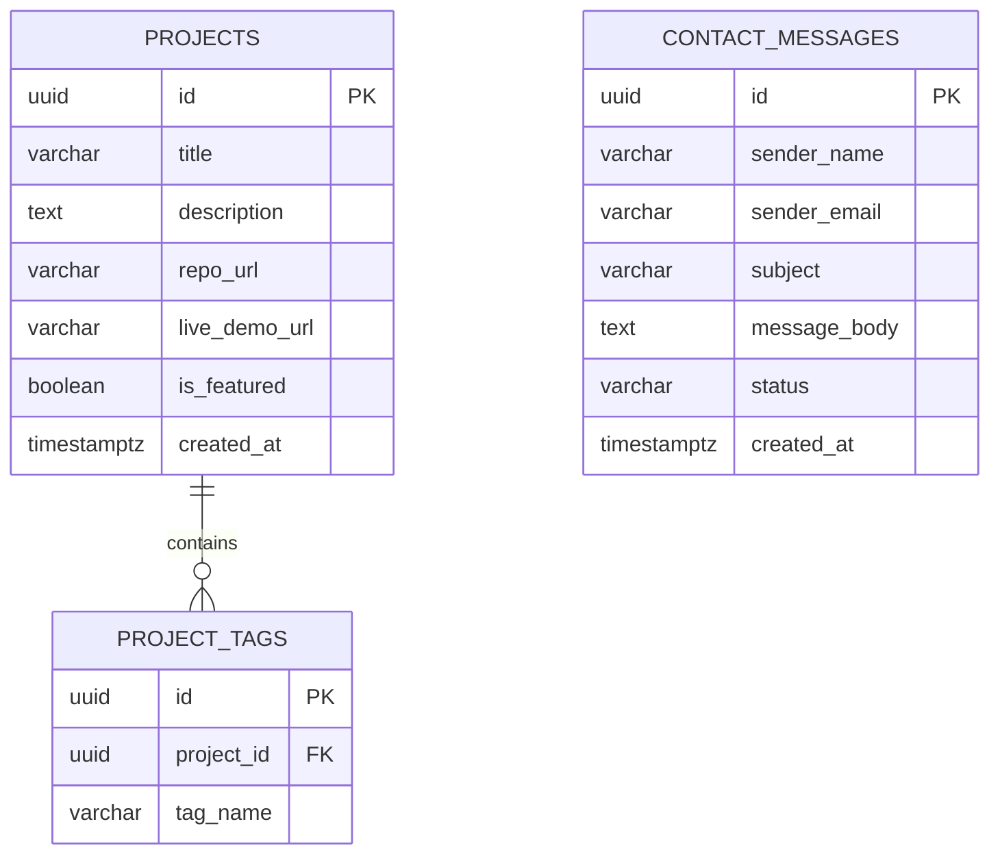

# Docs Specification - Portfolio Showcase & Contact Submission

The Portfolio Showcase & Contact Submission feature powers the web portfolio application built with Nuxt 4 and Vue 3. It highlights personal projects, technical skills, interactive demos, and allows visitors or recruiters to submit direct contact inquiries. The business value lies in establishing professional credibility, presenting engineering experience, and capturing inbound recruitment opportunities efficiently. Scope covers project list rendering, filtering by tech stack, contact message form handling, feedback validation, and response delivery.

**Version:** 0.1.0  
**Owner:** Rizqy  
**Last Updated:** 2026-07-27

## Portfolio Showcase & Contact Submission - Create

### Objectives

- Deliver visitor contact form submissions to the portfolio owner with 100% notification delivery reliability.
- Achieve sub-second client validation feedback on contact submission forms.

### Assumptions and Constraints

- Client browser supports modern JavaScript standard APIs and SSR HTML rendering.
- Email delivery/API transport endpoint must be operational to process incoming messages.

### Actors and Permissions

| Actor/Role | Permissions |
| --- | --- |
| Agent | Can submit contact inquiries, filter showcase projects, and trigger project previews. |
| Supervisor | Can update portfolio content data, manage featured projects, and read contact submissions. |

### User Flow (Main)

Purpose: Primary user journey from entry to completion, focused on the happy path and key decisions.

### Error and Validation Flow

Purpose: Validation, permission, and system error paths, including user feedback and recovery behavior.

### Sequence Diagram - Create

Purpose: UI to API interactions for the create flow, including lookup calls and record insertion.

### Acceptance Criteria

1. User can submit a contact inquiry with valid name, email, and message body.
2. Invalid email format or empty fields display immediate visual validation feedback.
3. Successful submission records the message, triggers notification transport, and shows success acknowledgment.

## Portfolio Showcase & Contact Submission - Update

### Objectives

- Allow the portfolio owner to update project metadata, tech stack tags, and hero section content dynamically.
- Reflect updated portfolio data instantly across all page routes without full site redeployments.

### Assumptions and Constraints

- Content modification APIs require authenticated administrator session access.
- Image assets must adhere to compressed WebP/PNG formatting guidelines for fast LCP performance.

### Actors and Permissions

| Actor/Role | Permissions |
| --- | --- |
| Agent | Can view updated portfolio content and filter items by category. |
| Supervisor | Can create, update, or hide portfolio projects and profile sections. |

### User Flow (Main)

### Sequence Diagram - Update

Purpose: UI to API interactions for update flow, including permission checks and side effects.

### Acceptance Criteria

1. Admin can update project details, stack tags, and repository links.
2. Attempting updates without admin credentials returns a 401/403 access denied response.
3. Successful updates refresh the live portfolio showcase immediately.

## Shared Diagrams and References

### Error and Validation Flow

Purpose: Validation, permission, and system error paths, including user feedback and recovery behavior.

### Data Model (ERD)

Purpose: Tables, relations, and key constraints required by this feature.

### API Contract Reference

| No | File | Description |
| --- | --- | --- |
| 1 | [contract-api/feature-openapi.yaml](contract-api/feature-openapi.yaml) | OpenAPI spec for portfolio endpoints, contact submissions, and errors. |

### Mock Data Reference

| No | File | Description |
| --- | --- | --- |
| 1 | [mockoon/feature-mock.json](mockoon/feature-mock.json) | Mock endpoints and sample portfolio project payloads. |

### State or Status Lifecycle (Optional)

Contact message submissions transition through: `received` -> `read` -> `replied` (or `archived`).

### Edge Cases

- Automated spam bots submitting high-frequency contact messages.
- Mobile browser client losing network connection during form POST request.
- Broken external links for project live demo or GitHub repository URLs.

### Observability

- Core Web Vitals (LCP, INP, CLS) performance metric monitoring across route transitions.
- Client analytics event tracking for contact form submissions and project link clicks.
- Server route exception monitoring for failed API or email transport dispatches.

## Change Log

| Date | Author | Change |
| --- | --- | --- |
| 2026-07-27 | Rizqy | Fixed Mermaid syntax syntax errors (double quotes around nodes with slashes/braces). |
